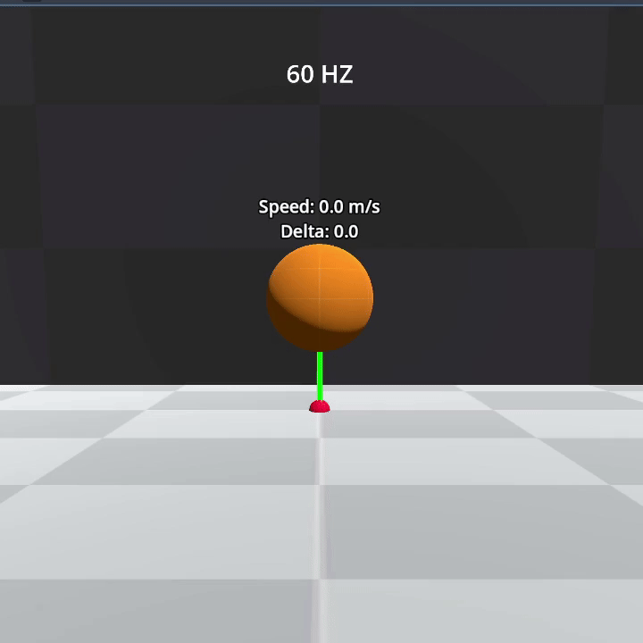
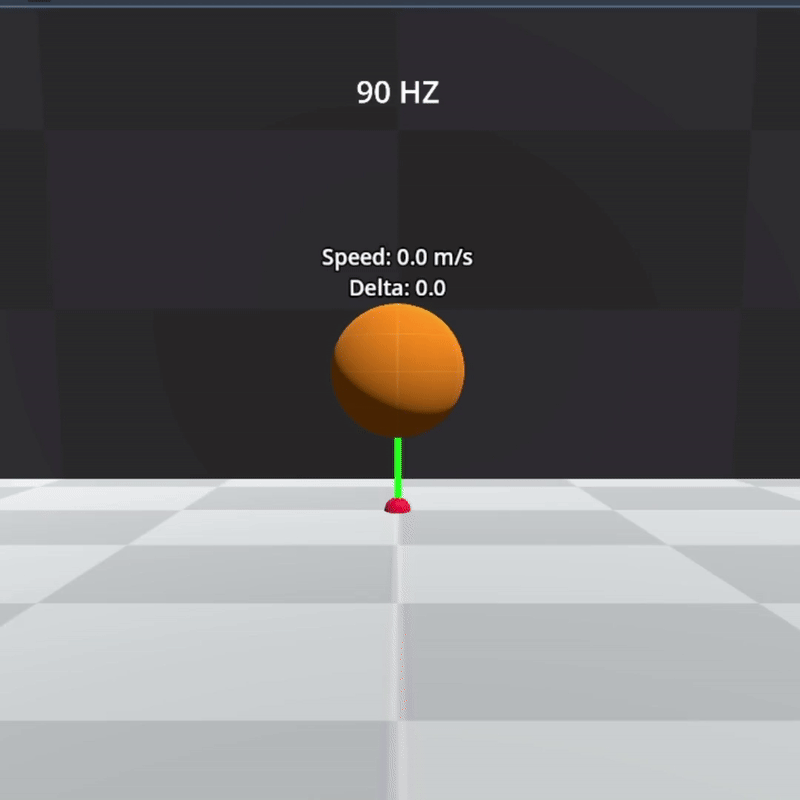
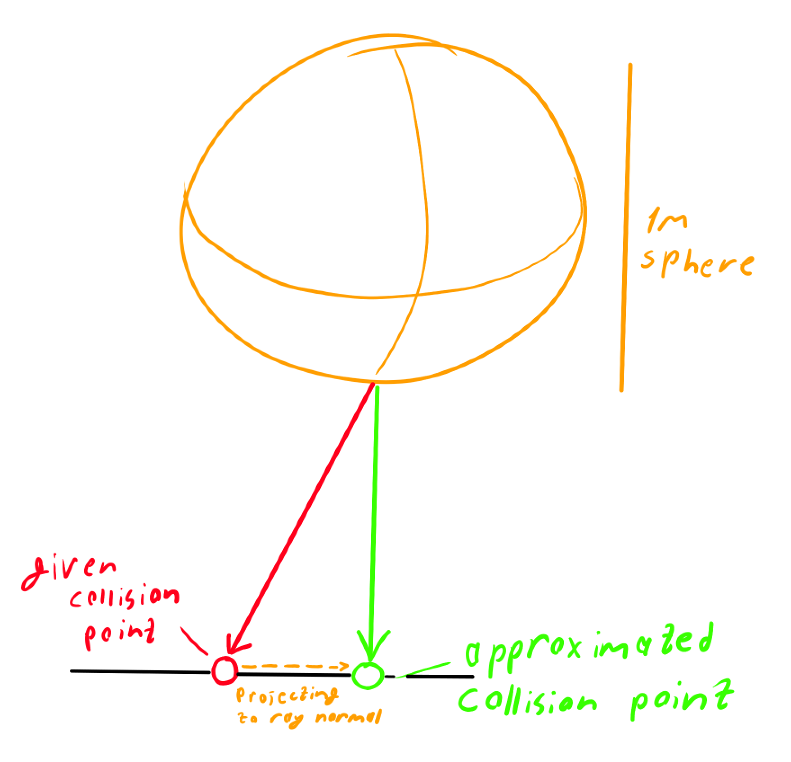

# Collision Correction for Godot Raycasts

This project provides a method to **correct raycast collision points in Godot** by addressing a common issue:  
collisions are detected with a **1-cycle delay**, meaning the reported collision point is slightly outdated.

---

## Problem: Collision Delay

When using raycasts in Godot to detect collisions, the reported collision point corresponds to the **previous cycle’s position**.  
This happens because collision detection occurs during the physics step, and the information is only available **one cycle later**.

### Example

#### cycle N  
- Object moves forward.  
- Collision actually happens here, but not yet reported.  

#### cycle N+1  
- Godot reports the collision point.  
- The collision position (red dot) belongs to the **previous frame**, not the current one (end of green line).

  
  
  

---

## Collision Correction Method

The correction method assumes there’s no **practically significant difference** between the true collision point in the previous frame and the current one.  
Thus, we can "correct" the collision by adjusting the given collision point to better match the current state.

### Idea

- Take the **given collision point** (from the previous cycle).  
- Project it along the **ray-aligned normal** to estimate the **corrected collision point** for the current cycle.  

  

---

## How It Works

1. Perform your usual raycast.  
2. When you get a collision point, treat it as **delayed**.  
3. Adjust it:
   - Project the collision point along the ray’s normal.  
   - This gives an approximation of the **current collision point**.  

This simple correction keeps physics responses smoother and avoids jitter caused by the frame-delay problem.

---

## Benefits

- More accurate collision positioning.  
- Better consistency in fast-moving objects.  
- Easy to integrate into existing Godot projects.  

---

## Example Use Case

This is particularly useful in:
- Character controllers.  
- Precise object placement.  
- Fast-moving projectiles.  

---

## Future Improvements

- Automatic integration as a Godot plugin.  
- Adjustable correction factor depending on object velocity.  
- Benchmarks comparing uncorrected vs corrected collisions.  

---

## License

MIT License. Free to use and modify.  

---

## Credits

Created by Luka Gobronidze  
